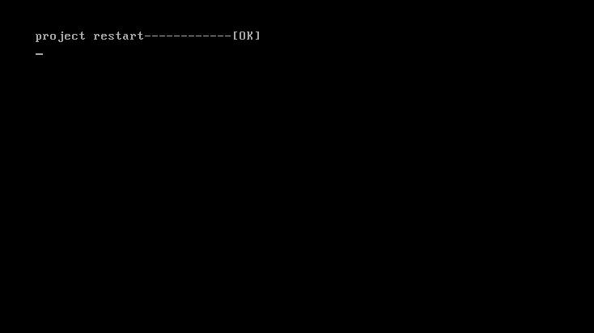
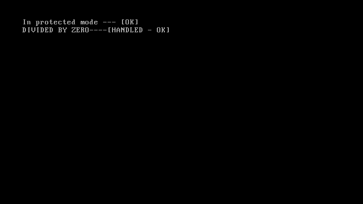
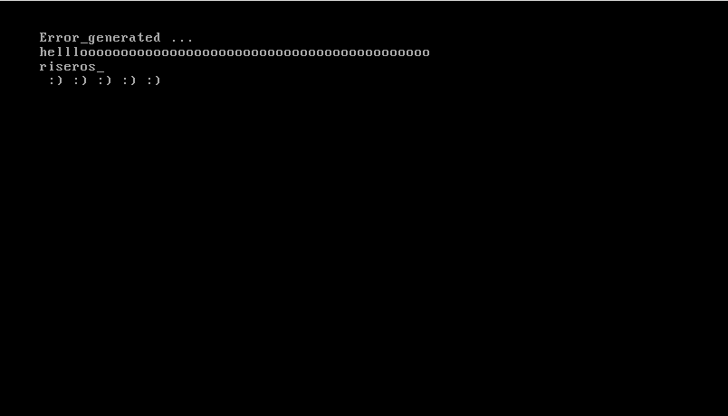
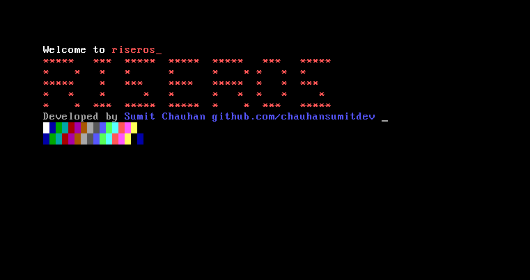
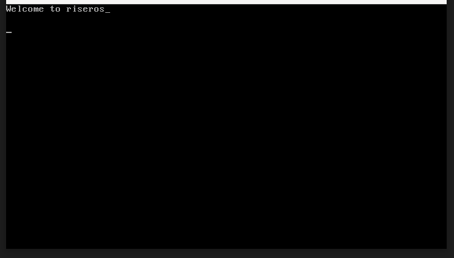

## timeline_
<table>
<tr>
    <td>
      
      
31 Dec 2024

    </td>
    <td>
      
      
28 Dec 2024

    </td>
  </tr>
  <tr>
    <td>
      
      
13 Dec 2024

    </td>
    <td>
      
      
15 Nov 2024

    </td>
    <td>
      
      
12 Nov 2024

    </td>
  </tr>
</table>
